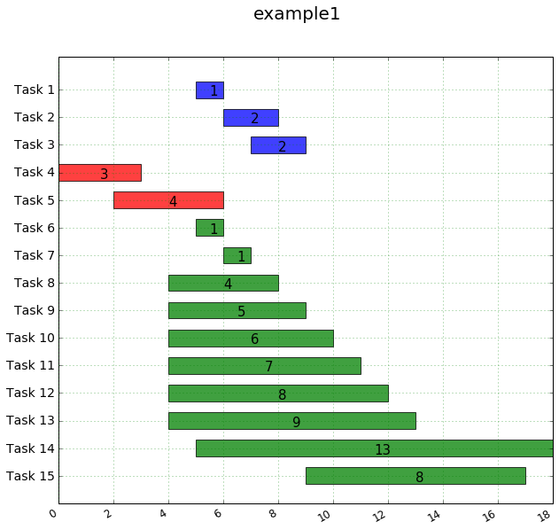

# matplotlib_gantt

Plot simple Gannt diagrams using python and matplotlib.

(Adapted from http://www.clowersresearch.com/main/gantt-charts-in-matplotlib/, which is based on https://bitbucket.org/DBrent/phd/src/1d1c5444d2ba2ee3918e0dfd5e886eaeeee49eec/visualisation/plot_gantt.py)

Usage example:
```python
TABLE = """
start,   end, event,  color
5,6, Task 1, blue
6,8, Task 2, blue
7,9, Task 3, blue
0,3, Task 4, red
2, 6, Task 5, red
5, 6, Task 6, green
6,7, Task 7, green
4, 8, Task 8, green
4, 9, Task 9 , green
4, 10, Task 10, green
4, 11, Task 11, green
4, 12, Task 12, green
4, 13, Task 13, green
5, 18, Task 14, green
9, 17, Task 15, green
"""
df = pandas.read_csv(StringIO.StringIO(TABLE))
g = Gannt()

g.draw_gannt(df,"example1")
```
Will generate the following diagram:



The module contains a utility to convert formats - 
```python
TABLE = """
5,    TASK STARTED   Task 1
6,    TASK ENDED Task 1
6,    TASK STARTED   Task 2
8,    TASK ENDED Task 2
7,    TASK STARTED   Task 3
9,    TASK ENDED Task 3
0,    TASK STARTED   Task 4
3,    TASK ENDED Task 4
2,    TASK STARTED   Task 5
6,    TASK ENDED Task 5
5,    TASK STARTED   Task 6
6,    TASK ENDED Task 6
6,    TASK STARTED   Task 7
7,    TASK ENDED Task 7
4,    TASK STARTED   Task 8
8,    TASK ENDED Task 8
4,    TASK STARTED   Task 9
9,    TASK ENDED Task 9
4,    TASK STARTED   Task 10
10,    TASK ENDED Task 10
4,    TASK STARTED   Task 11
11,    TASK ENDED Task 11
4,    TASK STARTED   Task 12
12,    TASK ENDED Task 12
4,    TASK STARTED   Task 13
13,    TASK ENDED Task 13
5,    TASK STARTED   Task 14
18,    TASK ENDED Task 14
9,    TASK STARTED   Task 15
17,    TASK ENDED Task 15
"""


df = pandas.read_csv(StringIO.StringIO(TABLE),header=None, names=["time", "event"])
g = Gannt()
df = g.convert_format(df,start_string="TASK STARTED", end_string="TASK ENDED")
g.draw_gannt(df,"example1")
```
